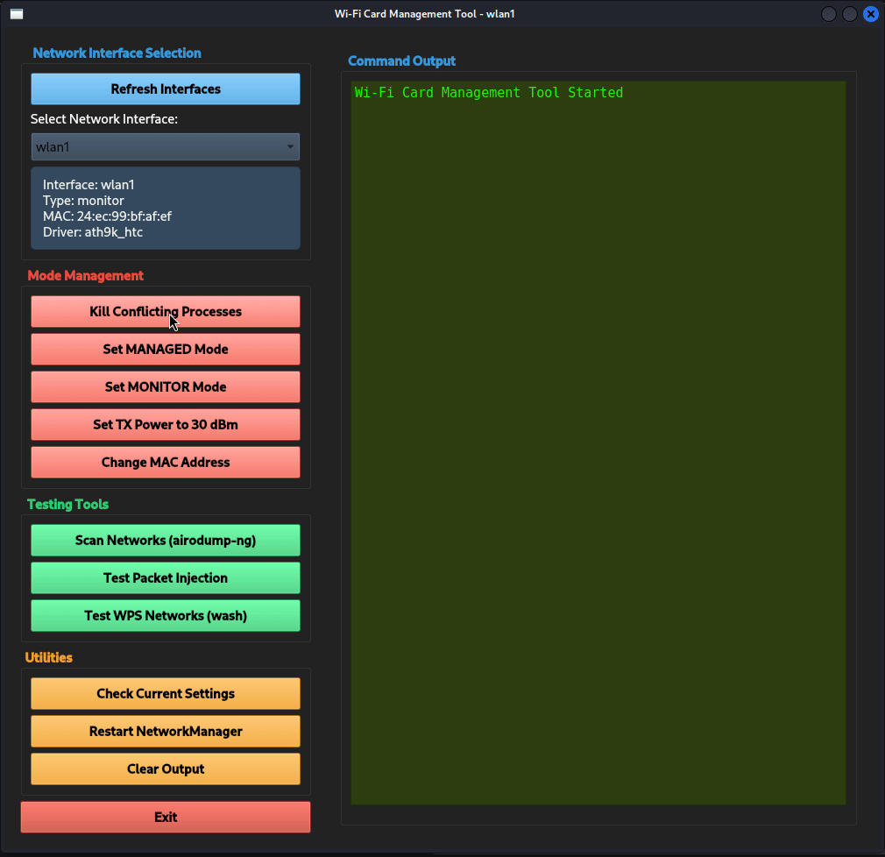

# Wi-Fi Card Management Tool for RTL8812AU

A Python-based GUI test tool for managing your wireless network interfaces that are designed for penetration testing and Wi-Fi security assessments.

## Features

- **Interface Management**: Switch between monitor and managed modes
- **Network Scanning**: Perform wireless network scans using airodump-ng
- **WPS Detection**: Identify WPS-enabled networks with wash
- **Packet Injection Testing**: Test your adapter's packet injection capabilities
- **MAC Address Spoofing**: Randomize your MAC address
- **Power Management**: Adjust TXpower for better signal transmission
- **Process Management**: Kill conflicting network processes
- 
## Demo



## Prerequisites

### System Requirements
- Linux-based operating system (Kali Linux recommended) - only tested it on 6.12.38+kali-amd64
- Wifi adapter supported by Linux Kali 6.12.38+kali-amd64. I tested it on 8812AU and AR9271. Both working.
- Python 3.6 or higher
- A wireless network adapter that supports monitor mode and packet injection

### Required System Packages
Install these dependencies before using the tool:

On Debian/Ubuntu/Kali Linux ( when not allready installed ) :
```bash
sudo apt update
sudo apt install python3-pyqt5 aircrack-ng wireless-tools wash macchanger ethtool
```

## Installation

1. Clone or download this repository:
```bash
git clone https://github.com/yourusername/wifi-tool.git
cd wifi-tool
```

2. Make the script executable:
```bash
chmod +x wifi_tool.py
```

3. Run the application (requires root privileges):
```bash
sudo ./wifi_tool.py
```

## Python Requirements

The tool requires PyQt5 for the graphical interface. You can install it using:

```bash
pip install PyQt5
```

## Usage Notes

- The tool must be run with root privileges (using sudo)
- Not all wireless adapters support monitor mode and packet injection
- Use this tool only on networks you own or have permission to test
- Compliance with local laws and regulations is your responsibility

## Troubleshooting

If you encounter issues:
1. Ensure your wireless adapter supports monitor mode
2. Verify all required packages are installed
3. Check that you're running the tool with sudo

## Disclaimer

This tool is intended for educational purposes and authorized security testing only. The developers are not responsible for any misuse or damage caused by this program.

